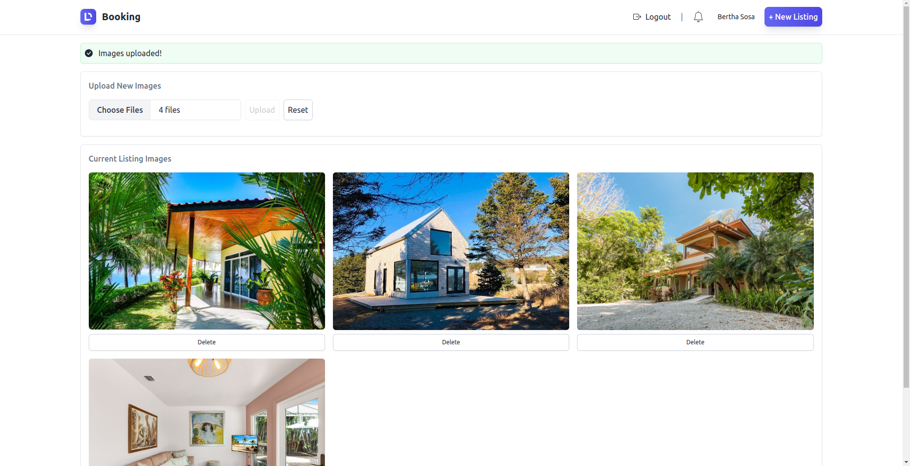

# booking-crm
- Booking-crm, web application, build using PHP-Laravel & inertia-vuejs.
- MySQL DB
- Using nginx web server, http/2.

## Project overview:

<table>
    <tr>
        <td></td>
        <td></td>
   </tr> 
    <tr>
        <td></td>
    <td></td></tr>
  </tr>
    <tr>
        <td></td>
        <td></td>
   </tr> 
    <tr>
        <td></td>
        <td></td>
    </tr> 
</table>

## Starting Project

1. install laravel packs

```composer
composer install
```

1. Run the following command to generate your app key:

```bash
php artisan key:generate
```

Create the symbolic link:

```bash
php artisan storage:link
```

2. install npm and run

```npm
npm install
```

```npm
npm run dev
```

```npm
npm run eslint
```

## Generate Data

```
php artisan migrate:fresh --seed
```

## PHP Unite Testing

```bash
php artisan test
```

## validate PHP-PSR2

In Order to Validate Controllers, Models, Unit Testings.

```bash
./vendor/bin/phpcs app/Http/Controllers/Listing/ListingController.php --standard=PSR2
```

----- 
Need helps? Reach me out

> Email: soulaimaneyahya1@gmail.com

> Linkedin: soulaimane-yahya

All the best :beer:
